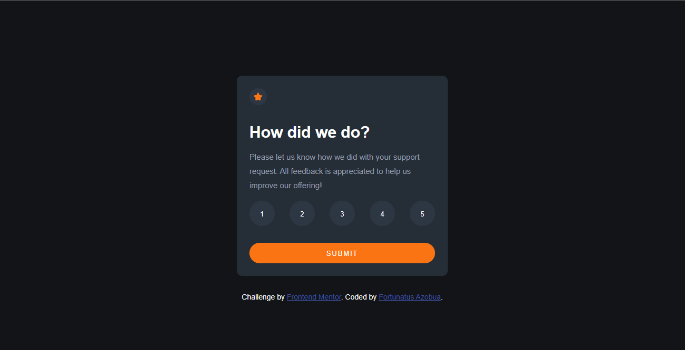

## Welcome! 👋


# Frontend Mentor - Interactive rating component solution

This is a solution to the [Interactive rating component challenge on Frontend Mentor](https://www.frontendmentor.io/challenges/interactive-rating-component-koxpeBUmI). Frontend Mentor challenges help you improve your coding skills by building realistic projects. 

## Table of contents

- [Screenshot](#screenshot)
- [Links](#links)
- [Built with](#built-with)
- [What I learned](#what-i-learned)
- [Author](#author)

### Screenshot




### Links

- Solution URL: [Add solution URL here](https://your-solution-url.com)
- Live Site URL: [Add live site URL here](https://your-live-site-url.com)


### Built with

- Semantic HTML5 markup
- CSS custom properties
- Flexbox
- CSS Grid


### What I learned

```css
.main-container ul li button:focus{
    background-color:hsl(217, 12%, 63%);
    }
```

```js
submitButton.addEventListener("click", () => {
    thanksContainer.classList.remove("hidden"); //*//
    mainContainer.classList.add("hidden"); 
}
```
## Author

- Github - [Fortunatus Azobua](https://www.github.com/FortuneGTL)
- Frontend Mentor - [@FortuneGTL](https://www.frontendmentor.io/profile/FortuneGTL)
- Twitter - [@fortune_festus](https://www.twitter.com/fortune_festus)

**Have fun building!** 🚀